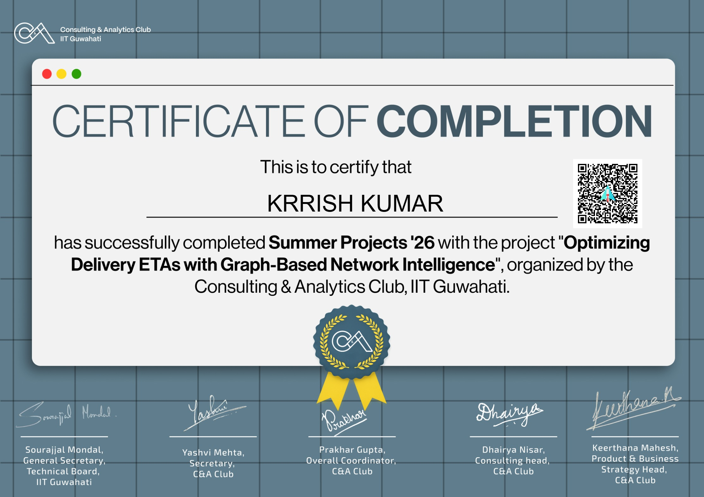

# 🚛 Optimizing Delivery ETAs with Graph-Based Network Intelligence



**Author:** Krishna Vijay Kunwar
**Program:** Consulting & Analytics Club, IIT Guwahati - Summer Projects '26

---

## Project Summary

This project builds a graph-based intelligence system for Delhivery's logistics network: models the network as a directed graph, computes a full set of bottleneck metrics, benchmarks a graph-enhanced ETA model against a trip-level baseline on two required metrics, builds a real FTL-vs-Carting decision framework, and translates findings into a quantified strategy memo for an operations leader.

**Data source:** Real Delhivery logistics dataset (144,867 segment-level scan records, Sept–Oct 2018).

## Key Findings

1. **A real, measured graph advantage.** Graph-enhanced model: 51.10 min MAE vs. baseline 69.69 min (26.7% improvement) and 34.89% vs. 27.16% of trips within 15% of actual (+7.73pp). Both required metrics confirm the advantage - measured directly, not assumed.

2. **The dataset's own train/test split is invalid for time-series modeling.** Both subsets span the identical date range - we built our own strict chronological split instead.

3. **The brief's ">20% SLA breach" threshold flags 96.6% of corridors** - making a binary flag non-discriminating. We replaced it with a volume-weighted severity ranking, and separately identified that 8% of "corridors" are actually same-hub pairs (intra-facility delays, not road-transit problems).

4. **A counter-intuitive, sample-verified routing finding.** Carting beats FTL on speed in 15 of 17 tested corridor profiles, often by 200+ minutes - contradicting the default assumption that FTL is the faster option. FTL only wins in Short-Haul, Low-Centrality-origin profiles.

5. **A corrected revenue/SLA claim.** Upgrading the top-3 bottleneck hubs does NOT reduce the network-wide late-delivery rate (96.2% vs. 96.1% - statistically indistinguishable, since lateness is a near-universal network property). The honest, defensible claim: top-3 hubs carry 21.4% of trip volume but 35.9% of total delay-minutes - a disproportionate severity contribution.

6. **IND000000ACB confirmed as the network's #1 bottleneck** on two independent, convergent graph metrics (betweenness centrality AND PageRank) - not a single-metric artifact.

## Repository Contents

| File | Description |
|---|---|
| `Delivery_Network_Intelligence.ipynb` | Full pipeline: data audit, stratified graph construction, full bottleneck metrics, Node2Vec embeddings, baseline vs. graph-enhanced benchmark, FTL/Carting framework, revenue quantification, network visualization |
| `delivery_data.csv` | Raw segment-level scan data |
| `network_bottleneck_visualization.png` | Graph visualization: top 40 hubs by betweenness centrality, bottleneck hubs and high-severity corridors highlighted |
| `dashboard.py` | Streamlit executive dashboard, built on verified findings (not hardcoded formulas) |
| `Network_Operations_Strategy_Memo.docx` | 1-page strategy memo for an operations leader: top 5 bottleneck hubs, FTL/Carting correction, quantified upgrade impact |

## How to Run

### 1. Folder structure
```
Delivery-ETA-Prediction/
├── Delivery_Network_Intelligence.ipynb
├── dashboard.py
├── delivery_data.csv
└── network_bottleneck_visualization.png  (generated by the notebook)
```

### 2. Run the pipeline
Open `Delivery_Network_Intelligence.ipynb` in Jupyter, VS Code, or Colab. Run all cells sequentially. Takes roughly 2-3 minutes (Node2Vec and betweenness centrality are the slowest steps on a graph of this size).

### 3. Launch the dashboard
```bash
pip install streamlit pandas numpy networkx xgboost node2vec scikit-learn matplotlib
python -m streamlit run dashboard.py
```

## Methodology Notes

This project deliberately documents and corrects several plausible-but-wrong framings: a near-universal SLA breach threshold that initially looked like a useful filter, a routing assumption (FTL = faster) that the data directly contradicts, and a revenue claim (upgrading hubs reduces the late-rate) that does not hold under scrutiny. Every quantitative claim in the strategy memo is traceable to a specific notebook cell and was verified by re-running the pipeline before being written down.
